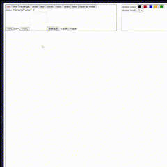
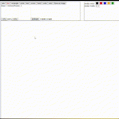
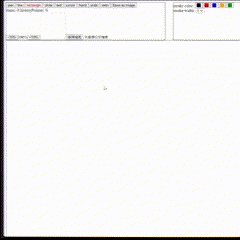
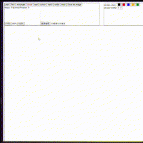
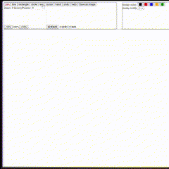
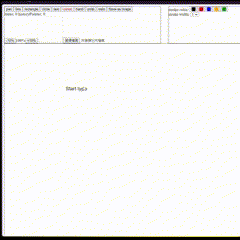
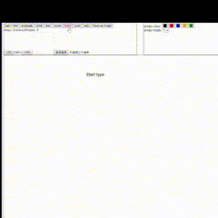

# Whiteboard
---
## Getting Started

First, run the development server:

```bash
npm install
```

```bash
npm run dev
# or
yarn dev
# or
pnpm dev
# or
bun dev
```

Open [http://localhost:3000](http://localhost:3000) with your browser to see the result.

## Features
- Pen
Use pen to draw whatever you want.


- Line
If you want to draw a straight, use line instead of pen.


- Rectangle
Use Rectangle to draw a Rectangle


- Circle
Use Circle to draw whatever a Circle


- Text
Use Text to type the word you want


- Cursor
Use pen to draw whatever you want


- Hand
Drag the white board to move



<!-- ## Learn More

To learn more about Next.js, take a look at the following resources:

- [Next.js Documentation](https://nextjs.org/docs) - learn about Next.js features and API.
- [Learn Next.js](https://nextjs.org/learn) - an interactive Next.js tutorial.

You can check out [the Next.js GitHub repository](https://github.com/vercel/next.js/) - your feedback and contributions are welcome!

## Deploy on Vercel

The easiest way to deploy your Next.js app is to use the [Vercel Platform](https://vercel.com/new?utm_medium=default-template&filter=next.js&utm_source=create-next-app&utm_campaign=create-next-app-readme) from the creators of Next.js.

Check out our [Next.js deployment documentation](https://nextjs.org/docs/deployment) for more details. -->
