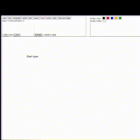
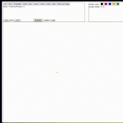

# Whiteboard
---
## Getting Started

First, run the development server:

```bash
npm install
```

```bash
npm run dev
# or
yarn dev
# or
pnpm dev
# or
bun dev
```

Open [http://localhost:3000](http://localhost:3000) with your browser to see the result.

## Features
### Pen
Use pen to draw whatever you want. \


### Line
Create straight lines. \


### Rectangle
Draw rectangles on the whiteboard. \


### Circle
Draw circles on the whiteboard. \


### Text
Add text to the whiteboard. \


### Cursor
Interact with objects on the whiteboard. \
Click an object to select, drag, or resize it.\


### Hand
Move the whiteboard around. \
Click and drag on the empty space to pan the whiteboard. \


### Undo/Redo
Allows you to undo or redo recent actions on the whiteboard. \

### Save as image
Save the current whiteboard state as an image file. \

### Scale
Zoom in or out on the whiteboard to adjust the view. \


### Upload image
Load an existing image onto the whiteboard. \



<!-- ## Learn More

To learn more about Next.js, take a look at the following resources:

- [Next.js Documentation](https://nextjs.org/docs) - learn about Next.js features and API.
- [Learn Next.js](https://nextjs.org/learn) - an interactive Next.js tutorial.

You can check out [the Next.js GitHub repository](https://github.com/vercel/next.js/) - your feedback and contributions are welcome!

## Deploy on Vercel

The easiest way to deploy your Next.js app is to use the [Vercel Platform](https://vercel.com/new?utm_medium=default-template&filter=next.js&utm_source=create-next-app&utm_campaign=create-next-app-readme) from the creators of Next.js.

Check out our [Next.js deployment documentation](https://nextjs.org/docs/deployment) for more details. -->
